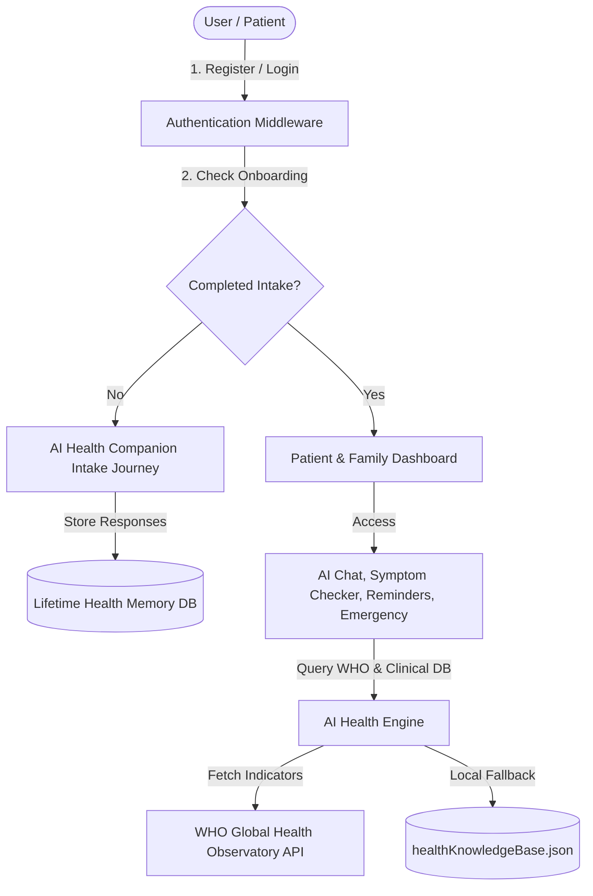
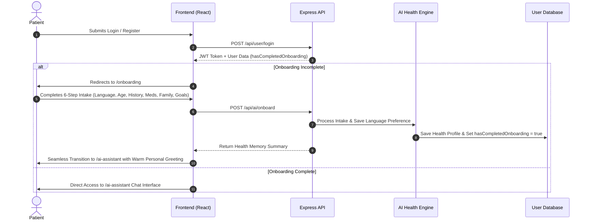
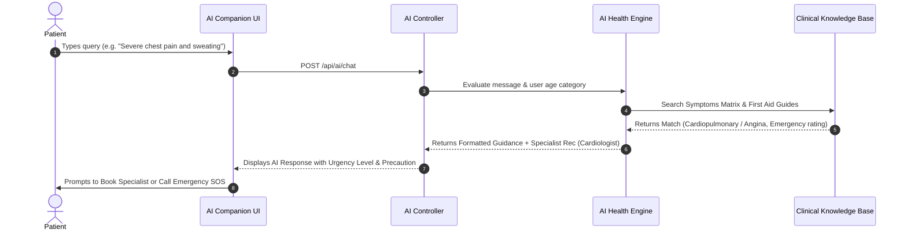
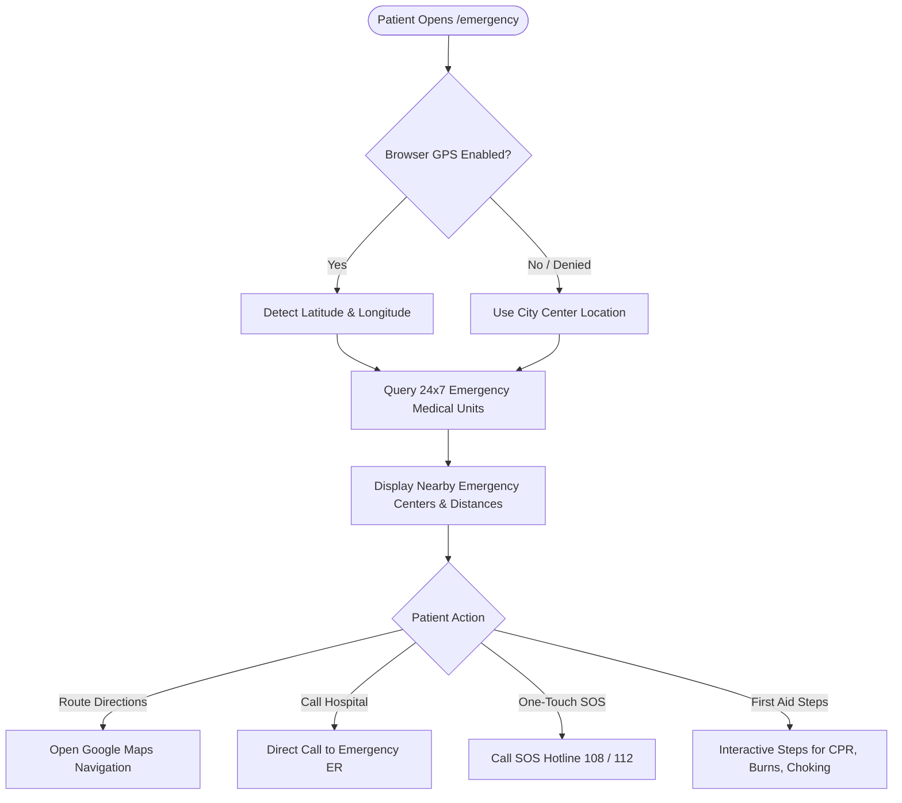
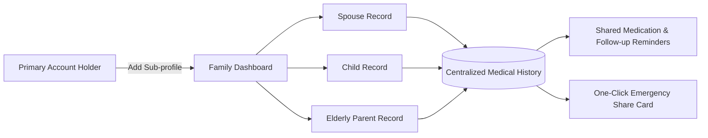

# 🩺 AI Healthcare Assistant & Doctor Platform — Detailed Documentation (`detaildoctor.md`)

Welcome to the comprehensive technical and operational documentation for the **AI Healthcare Assistant & Ecosystem**. This document details the platform vision, architecture, user role credentials, complete end-to-end workflows, system process diagrams, monetization model, and data security standards.

---

## 🌐 1. Brand Definition & Core Vision

- **Platform Identity:** A digital healthcare ecosystem where AI acts as a personal doctor, guardian, and emergency response guide.
- **Core Promise:** *“Your health, your family, your lifetime — guided by AI.”*
- **Tone & Personality:** Trustworthy, empathetic, accessible, and highly intelligent.
- **Target Audience:**
  - **Patients & Individuals:** Seeking affordable, 24/7 evidence-based health guidance.
  - **Families:** Wanting centralized, lifetime health management for children, spouses, and elderly parents.
  - **Doctors & Medical Professionals:** Looking for digital reach, patient association, and automated follow-up care management.

---

## 🔐 2. Access Credentials & Service Ports

| Service / Role | Access URL | Email / Username | Password | Notes |
| :--- | :--- | :--- | :--- | :--- |
| **Backend API** | `http://localhost:4000` | N/A | N/A | RESTful Express API with WHO integration |
| **Patient Portal** | `http://localhost:5175` | `patient@test.com` | `Patient123` | Patient & Family Health Portal |
| **Doctor Portal** | `http://localhost:5176` | `richard@prescripto.com` | `Doctor@123` | Associated Doctor Portal |
| **Super Admin** | `http://localhost:5176` | `admin@prescripto.com` | `Admin@123` | Super Admin Governance Dashboard |

> **Note:** Admin credentials are set in `backend/.env`. Default doctor can be seeded via `node createDoctor.js` in the `backend/` directory.

---

## 🏗️ 3. Platform Architecture & Data Flow

The platform uses a modular architecture combining Node.js Express endpoints, a dual persistence layer (MySQL with auto JSON file fallback), React/Vite frontends, and an integrated **AI Health Engine** linked to the **World Health Organization (WHO)** public data API and verified clinical knowledge base.

---

## 🔄 4. Process & Workflow Diagrams

### 4.1 Post-Login AI Health Journey & Onboarding Flow
Upon registration or login, the platform verifies whether the user has completed their AI intake. If incomplete, it automatically routes them to the dedicated **6-Step Onboarding Journey (`/onboarding`)**:

1. **Step 1 — Language & Script Mix Selection:** Select preferred language (English, Hinglish [Hindi+English], Marathiglish [Marathi+English], Hindi, Marathi, Spanish, French, German).
2. **Step 2 — Personal Details:** Age & Gender intake.
3. **Step 3 — Health History:** Lifetime medical history, past illnesses, and chronic conditions.
4. **Step 4 — Medications & Allergies:** Daily prescription drugs & known food/medicine allergies.
5. **Step 5 — Family Dashboard Setup:** Add family members (spouse, children, parents) step-by-step.
6. **Step 6 — Lifestyle & Goals:** Activity levels, sleep quality, and personal health goals.

Upon completing all steps, the system sets `hasCompletedOnboarding = true` and seamlessly transitions to the **AI Doctor Companion Chat interface (`/ai-assistant`)**.

### 🤖 Human-Like Conversational Intelligence Engine
- **Empathetic Doctor Friend Persona:** Replaces robotic disclaimers with warm, caring human conversation (e.g. *"Sunilijiye [Name], tension mat lijiye... Bilkul mat ghabraiye, main aapke saath hu!"*).
- **Code-Mixed Multilingual Understanding:** Automatically detects and responds in **Hinglish** (Hindi in English script), **Marathiglish** (Marathi in English script), native scripts, or English depending on how the user speaks.

---

### 4.2 AI Symptom Checker & WHO Data Flow

---

### 4.3 Emergency Locator & First Aid Response Flow

---

### 4.4 Family Dashboard & Shared Medical Records

---

## 💰 5. Monetization & Subscription Framework

| Plan Type | Price | Target Audience | Included Features |
| :--- | :--- | :--- | :--- |
| **Patient & Family Pass** | **₹100 / month** *(7-Day Free Trial)* | Individuals & Families | Lifetime AI Companion, Health Memory, Family Sub-accounts, Emergency Locator, First Aid Module, Reminders |
| **Doctor Association** | **₹300 / month** | Healthcare Professionals | Associated Patient Consultation, Digital Prescriptions, Clinical Records, Patient Follow-up Dispatcher |

### Revenue Streams:
1. **Recurring Subscriptions:** Monthly Patient (₹100) & Doctor (₹300) passes.
2. **Insurance Tie-Ins & Analytics:** Anonymized population health analytics & preventive care partnerships.
3. **Emergency Service Partnerships:** Priority ambulance dispatch integration.

---

## 🔐 6. Data Security, Privacy & HIPAA/GDPR Compliance

1. **Encrypted Record Storage:** User medical histories and health profiles are stored with strict data isolation.
2. **Access Control:** Patients maintain total ownership over who can access or view their records.
3. **One-Click Emergency Sharing:** Generates encrypted short-lived sharing tokens (`EMG-XXXXX`) allowing first responders or attending ER doctors to view critical medical flags (blood type, severe allergies, chronic conditions, emergency contacts) instantly during emergencies.

---

## 🚀 7. Phased Expansion Roadmap

- **Phase 0 (MVP - Currently Live):** Subscriptions system, multi-role governance (Super Admin, Doctor, Patient, Family), AI Health Intake Journey, Geolocation Emergency Locator, First Aid module, WHO Knowledge Base.
- **Phase 1 (Expansion):** Enhanced Doctor association workflows, digital consultation notes, automated SMS/WhatsApp reminders.
- **Phase 2 (Advanced AI & Wearables):** Wearable device integration (heart rate, glucose, BP monitors), predictive disease risk analytics, preventive health suggestions.
